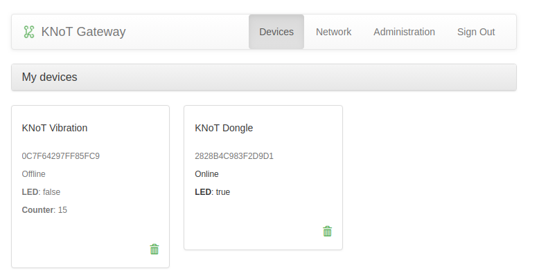

Quick Start Guide
=================

This guide will help you to set up thing develop environment, then build and run a thing application.

----------------------------------------------------------------

Thing Develop Environment
--------------------------

The fastest way to get started to use or to develop for KNoT thing is to use the `KNoT Thing Docker container <../thing/thing-docker.html>`_.

Another way is get KNoT Thing source code, following all steps listed on `requirements <../thing/thing-requirements.html>`_ to be ready.

With this set up, will be possible the utilization of `KNoT CLI application <../thing/thing.cli.html>`_.

----------------------------------------------------------------

KNoT Thing Hello World
----------------------

Connect and set the target board
'''''''''''''''''''''''''''''''''

You may be using one of the two supported boards: DK (nrf52840_pca10056) or Dongle (nrf52840_pca10059).

   - If using the DK:

      - Connect the board to a USB port.
      - Set the DK as the default target board.

      .. code-block:: bash

         $ knot board dk

   - If using the Dongle:

      - Connect the board to a USB port.
      - Press the reset button. The red led will blink.
      - Set the Dongle as the default target board.

      .. code-block:: bash

         $ knot board dongle

Build KNoT Hello World App
''''''''''''''''''''''''''

- Go to the KNoT Hello directory.

   .. code-block:: bash

      $ cd $KNOT_BASE/apps/hello

- Build and flash apps.

   .. code-block:: bash

      $ knot make --mcuboot

.. note:: The option 'mcuboot' flashes the compiled program and the mcuboot bootloader at the end of building.

Monitor the output
''''''''''''''''''

You can use minicom or any other serial port reader to monitor the app output.

- Install minicom

.. tip:: You can install minicom on debian based systems by using: ``$ sudo apt-get install minicom``

.. code-block:: bash

   $ minicom -D <your-device>

.. tip:: If you are using debian the device usually is something like /dev/ttyACM0.

----------------------------------------------------------------

KNoT Setup App
--------------

Considering that the KNoT Gateway is configured.

You may use the `mobile KNoT Setup App <../app-setup/app-setup.html>`_ to configure the thing network.

After the correct configuration of the Thing, **reset the board**.

----------------------------------------------------------------

Connected Thing
---------------

If all the steps were followed correctly, will be possible to see the KNoT Dongle connected on KNoT WebUI.

----------------------------------------------------------------

KNoT Cloud SDK
--------------

To interact with data from device, utilize KNoT Cloud SDK to construct a User Application.
